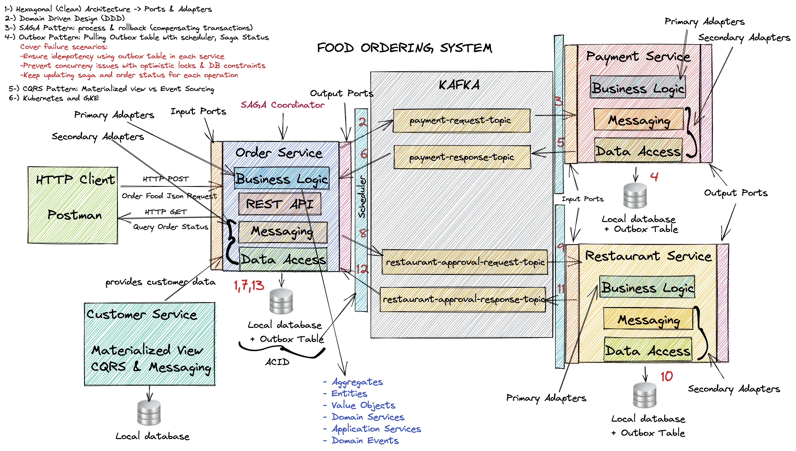
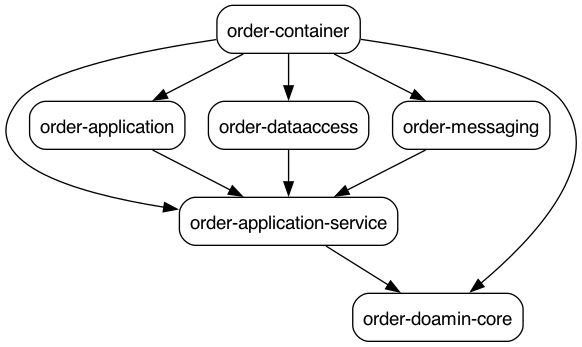
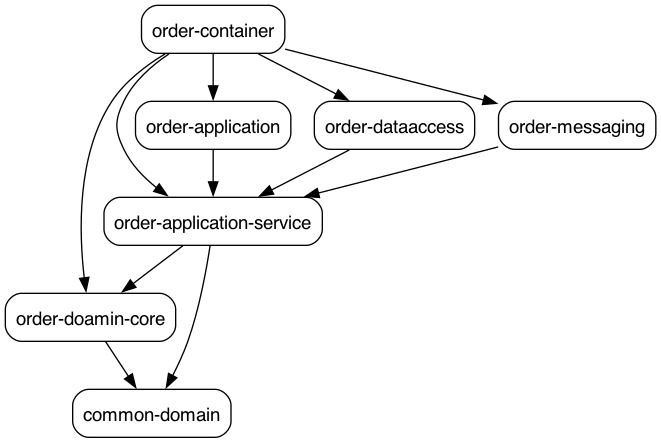
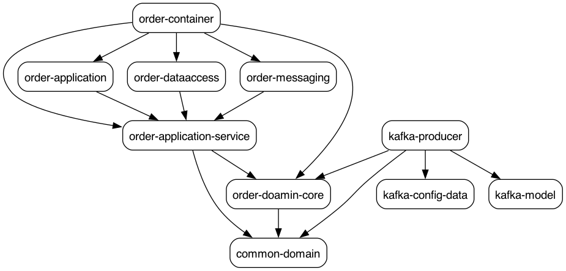
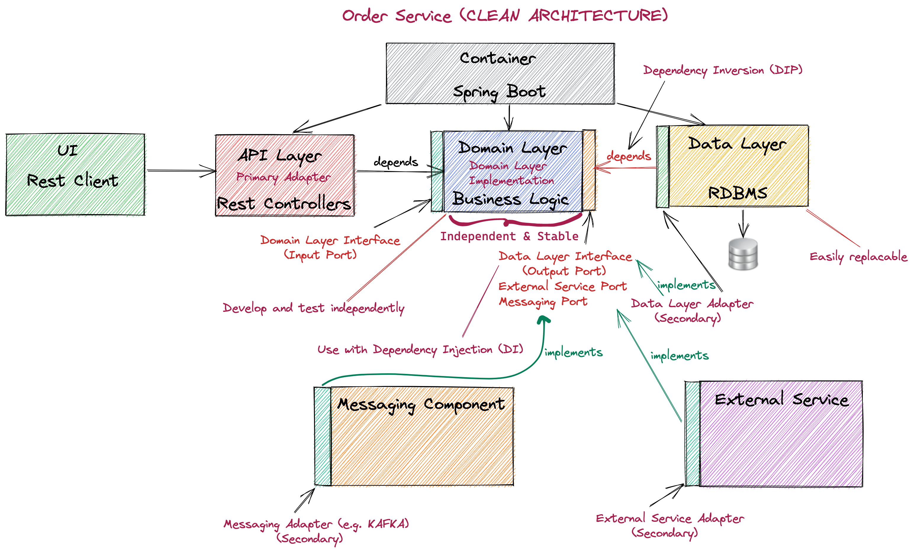
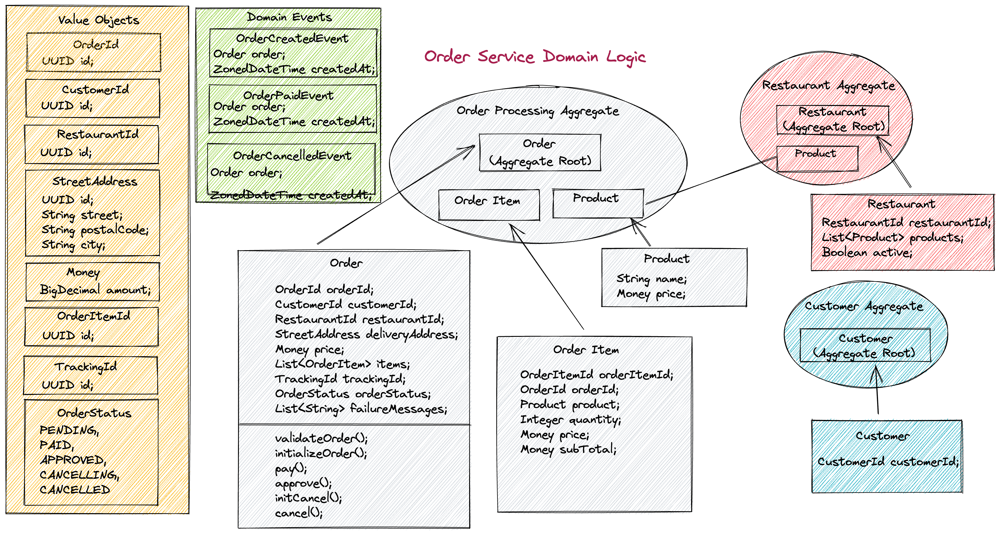
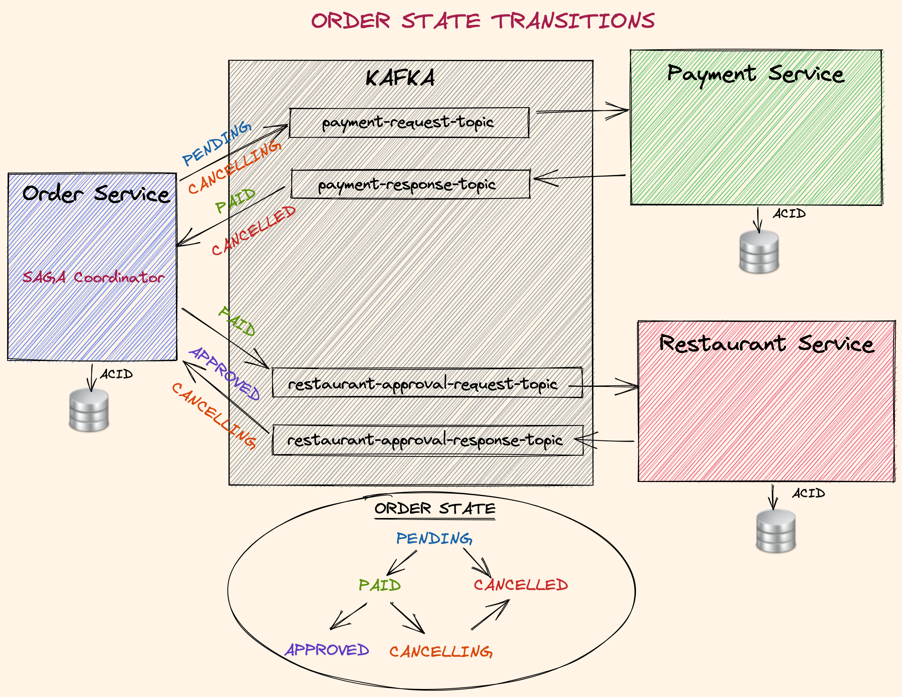
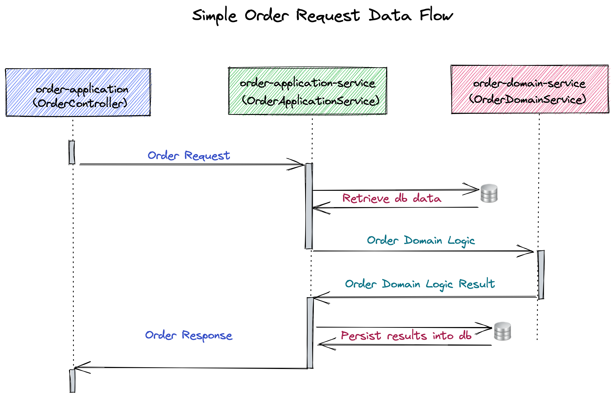
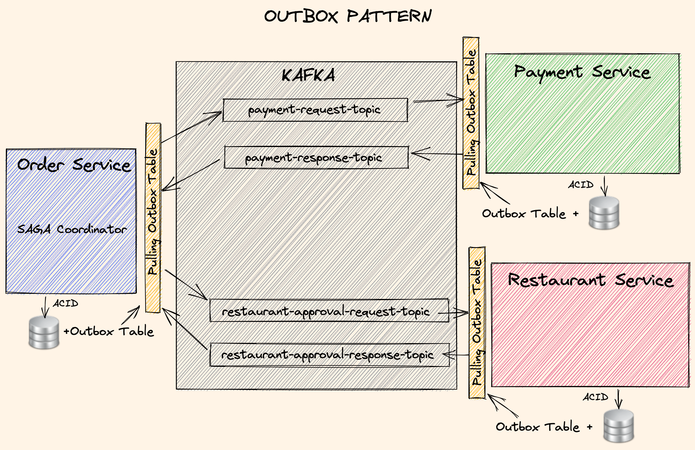
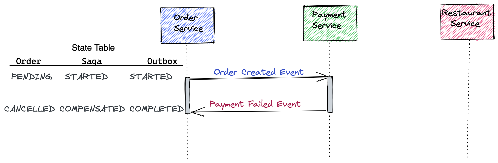

# Getting Started



### Reference Documentation

to generate graphic path of dependencies:

```shell
brew install graphviz
mvn com.github.ferstl:depgraph-maven-plugin::aggregate -DcreateImage=true -DreduceEdges=false -Dscope=compile "-Dincludes=com.food.ordering.system*"
```

# Services

## Order service

### dependencies


after add common module






### High level design


### Low level design


### order status transitions





## Customer service

## Payment service

## Restaurant service

## Kafka

#### Zookeeper
```shell
docker compose -f common.yaml -f zookeeper.yaml up -d
-- check status zookeeper

echo ruok | nc localhost 2181
-- return iamok
```

#### Kafka
```shell
docker compose -f common.yaml -f kafka_cluster.yaml up -d
```

#### Init Kafka
```shell
docker compose -f common.yaml -f init_kafka.yaml up -d
```

browser localhost:9000 abd add cluster
name: food-ordering-system
zookeeper hot: zookeeper:2181

## Outbox Pattern





